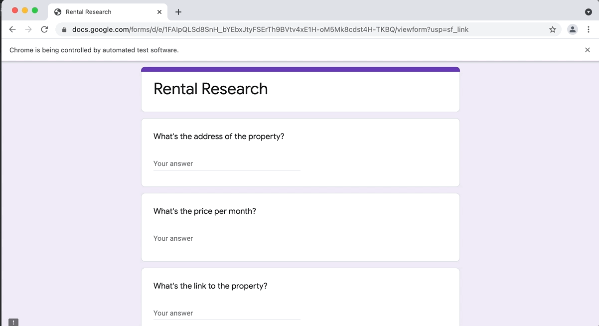

# Data Entry Job Automation
A data entry job automation bot that searches for potential rentals on Zillow, scrapes the relevant data with Beautiful Soup, and completes a Google form with that data using Selenium Web Driver.

## Feature Tasks
1. Create a Google Form with three short answer questions.
1. Use BeautifulSoup/Requests to scrape all the listings from the Zillow web address (Step 4 above).
1. Create a list of links for all the listings you scraped. 
1. Create a list of prices for all the listings you scraped. 
1. Create a list of addresses for all the listings you scraped. 
1. Use Selenium to fill in the form you created (step 1,2,3 above). Each listing should have its price/address/link added to the form. You will need to fill in a new form for each new listing. 

