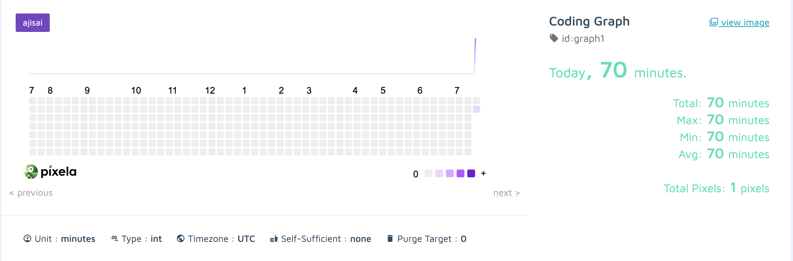

# Habit Tracker
A full-CRUD habit tracker built with Pixela, requests, and datetime. This graph tracks how many minutes of 
coding I do per day.

The graph is live on [Pixela](https://pixe.la/v1/users/strassy/graphs/graph1.html).

# Feature Tasks
1. Create a pixela account using a post request with JSON data.
1. Create a graph using a post request with JSON data and headers.
1. Add a tracked event to the graph using a post request with JSON data and headers.
1. Update an existing tracked event to the graph using a post request with JSON data and headers.
1. Delete an existing tracked event to the graph using a post request with headers.
