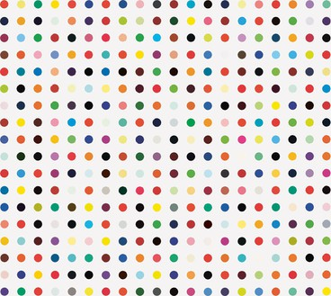

# Hirst Paining
A digital art creator inspired by Damien Hirst's spot paintings, which feature rows of randomly colored 
circles. These paintings sell for as much as $3.4 million and are often made by his assistants.

## A Hirst Spot Painting

## Hirst Painting Program Requirements
- utilize [Turtle Graphics](https://docs.python.org/3/library/turtle.html#module-turtle)
- create a 10 X 10 grid of dots
- use [colorgram.py](https://pypi.org/project/colorgram.py/) to sample colors from an existing Hirst painting
- each dot is a random color
- each dot is 20 pixels
- dots are spaced 50 pixels apart

## A "spot painting" created by my app

## [Run this Code on Repl.it](https://replit.com/@SaraStrasner/Hirst-Painting)