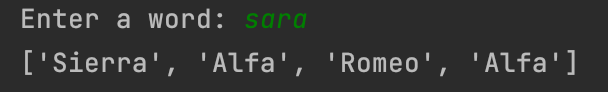

# Nato Alphabet
Returns the NATO alphabet for each letter in a user input string. Built using list and dictionary comprehension. 
Pandas is used to import, read, and manipulate a .csv file of the NATO alphabet. 

## Feature Tasks
1. Import and read the `nato_phonetic_aplhabet.csv` file using pandas
1. Create a dictionary in this format: `{"A": "Alfa", "B": "Bravo"}`
1. Create a list of the phonetic code words from a word that the user inputs.
