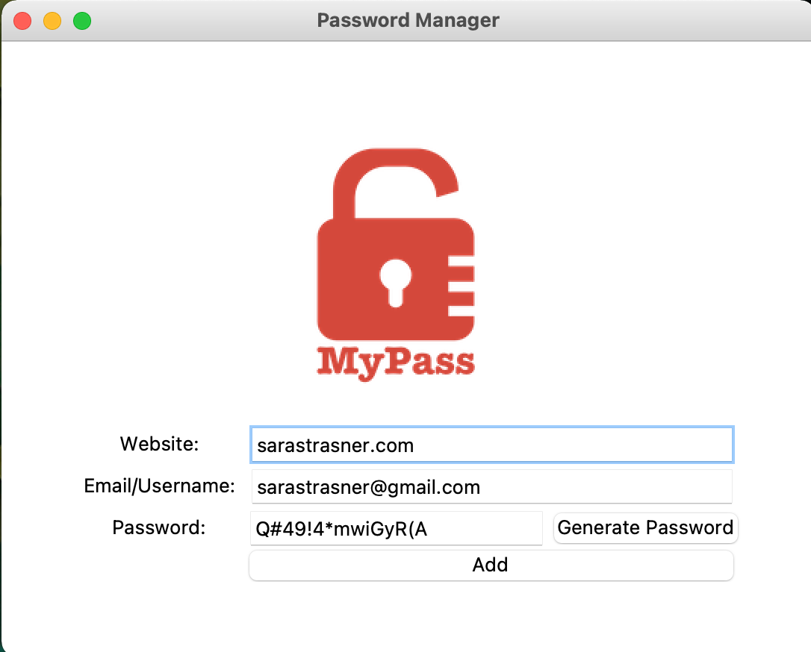

# Password Manager
A password manager built using [Tkinter](https://tkdocs.com/). The app can provide a randomized password 
if needed and saves the website, username, and password to a local file.

# Feature Tasks
1. Create entry fields, labels, and buttons.
1. Lay out the above canvas components using grid.
1. Upon launch:
   1. Focus the cursor into the website entry field.
    1. Pre-populate the email field with your primary email address.
1. Validate that the user has entered data into every field.
   1. If not, generate a popup alerting the user to not leave any fields empty.
1. When the user clicks 'Add':
   1. Take inputs from the website entry, email/username entry, and password entry. 
   1. Confirm that the user wants to save the entered data via a popup.
   1. Save them in a file called `data.txt`.
   1. Format the data as `website | email | password` with a new line at the end.
   1. Clear the entry fields.
1. Create a randomized password when the user clicks 'Generate Password.'
   1. Pre-populate the password field with this randomized password.
   1. Copy this password to the clipboard using `pyperclip`.
   
