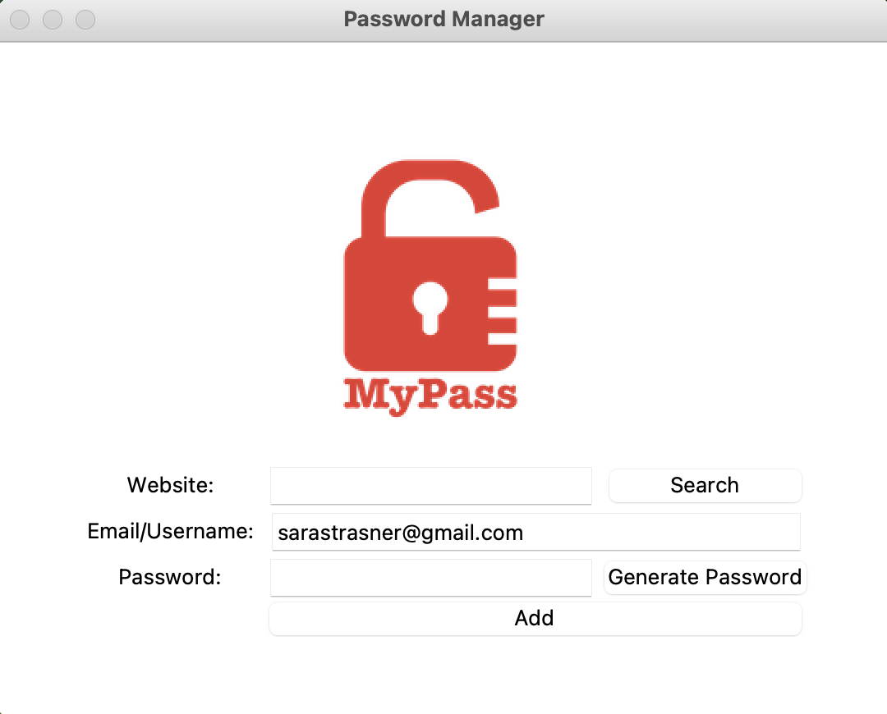

# Password Manager v2
An updated version of the password manager that handles exceptions related to the `data.json` file. This version also
has a search feature so users can search for an existing password.

# Feature Tasks
1. Save data as `.JSON` instead of `.txt`
   1. Read, write, and update data from JSON
   1. Handle exceptions for adding passwords when `data.json` does not exist the first time the program is run
1. Add a search functionality so users can search for a password by entering a website
   1. Handle exceptions for searching when `data.json` does not exist the first time the program is run