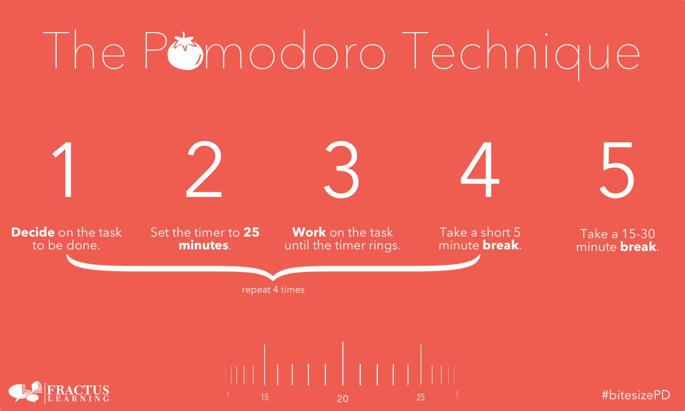

# Pomodoro App
An application built using [tkinter](http://tcl.tk/man/tcl8.6/contents.htm)
 to help users implement the Pomodoro Technique when working.

## Final App

## Feature Tasks
1. Lay out the canvas with a tomato image, checkmark(s), title text, and start and reset buttons
1. Use grid to place the elements on the canvas
1. Style the elements using the global color variables
1. Write the countdown mechanism
   1. Style the minutes and seconds to display as 00:00
1. Create the timer mechanism
   1. Increment a reps variable each time the timer starts over
    1. Use this variable to determine whether the user should start another working session or take a short or 
       long break.
       1. If the user is working, the title text should read "Work" in green text.
       1. If the user's on a break, change the title text to "Break" in red text for a long break or 
          pink text for a short break.
1. Create the reset timer functionality. Clicking the reset button should:
   1. Stop the timer
   1. Change title label back to "Timer"
   1. Reset the check marks
   1. Reset the timer text to 00:00
   1. Reset reps back to 0
    
    

