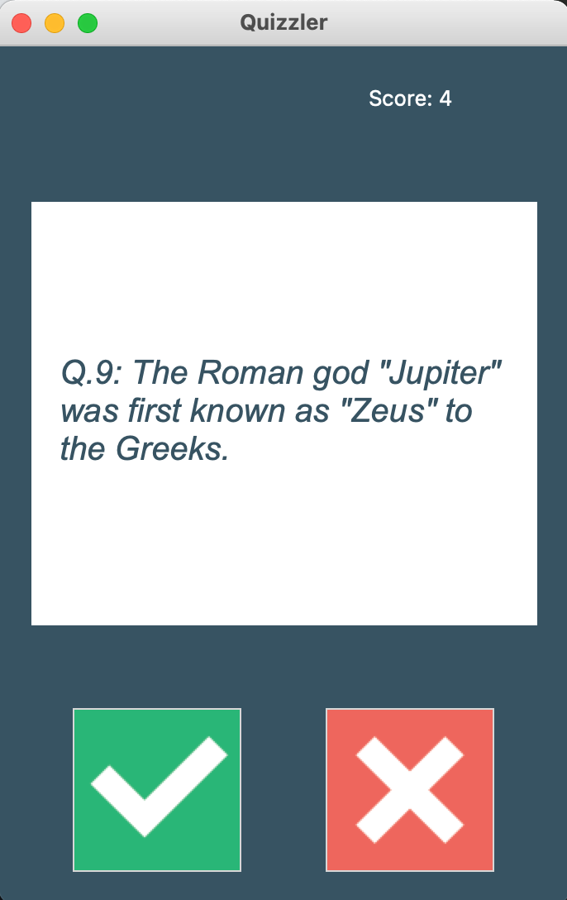

# Quizzler App
A refactored version of a CLI-based quiz app that included a GUI (via Tkinter) and 
pulls new data from the Open Trivia database each time the app runs.

# Feature Tasks
1. Rework existing quiz app to make a get request to the Open Trivia database to get 10 questions  every time the app runs
1. Unescape the HTML entities on the returned text
1. Plug the results of the above get request into the existing game architecture
1. If the user answers the question correctly, change the background to green and increment the score.
1. If the user answers incorrectly, change the background to red.