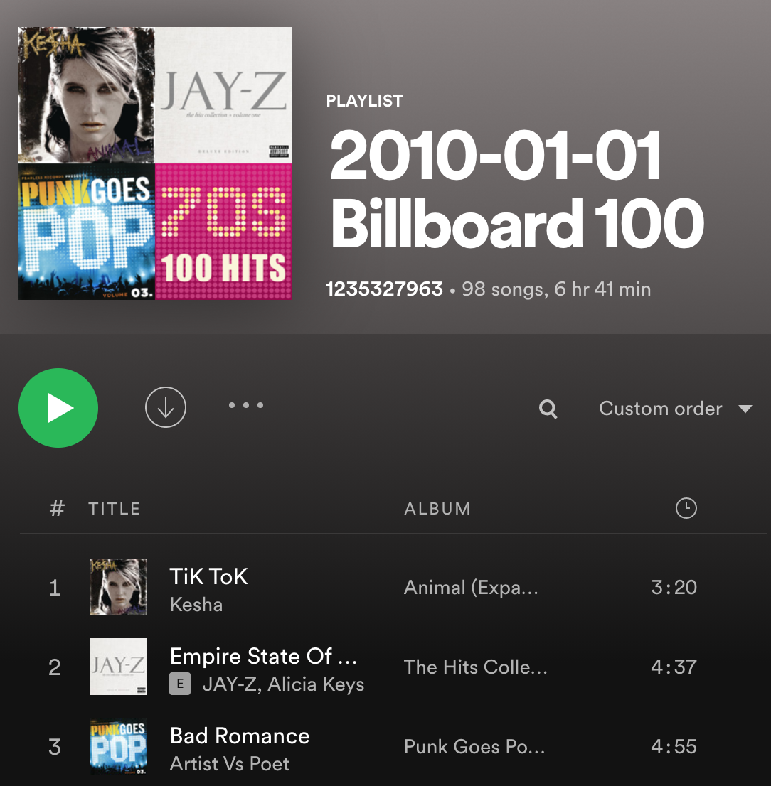

# Musical Time Machine
A "Time Machine" that creates a Spotify playlist of the Billboard Top 100 songs for a user-provided date. Uses BeautifulSoup and requests for web scraping and Spotipy for authentication and playlist creation.

## Feature Tasks
1. Create an `input()` prompt that asks what year you would like to travel to in YYYY-MM-DD format.
1. Scrape the top 100 song titles on that date into a Python list.
1. Authentication with Spotify
    1. Go to the developer dashboard and create a new Spotify App
    1. Copy the Client ID and Client Secret into your Python project.
    1. Using the Spotipy documentation, figure out how to authenticate your Python project with Spotify using your unique Client ID/ Client Secret.
1. Using the Spotipy documentation, create a list of Spotify song URIs for the list of song names you found from step 1 (scraping billboard 100).
1. Using the Spotipy documentation, create a new private playlist with the name "YYYY-MM-DD Billboard 100", where the date is the date you inputted in step 1.

   