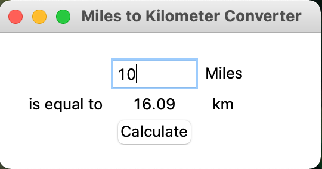

# Unit Converter
A GUI program that converts miles to kilometers built with Tkinter.

[Tkinter Documentation](http://tcl.tk/man/tcl8.6/contents.htm)

## Feature Tasks
- Use Tkinter to create the labels, button, and input fields
- Use grid to lay out the elements
- When the button is clicked, convert the miles to kilometers
- Display the converted value onscreen